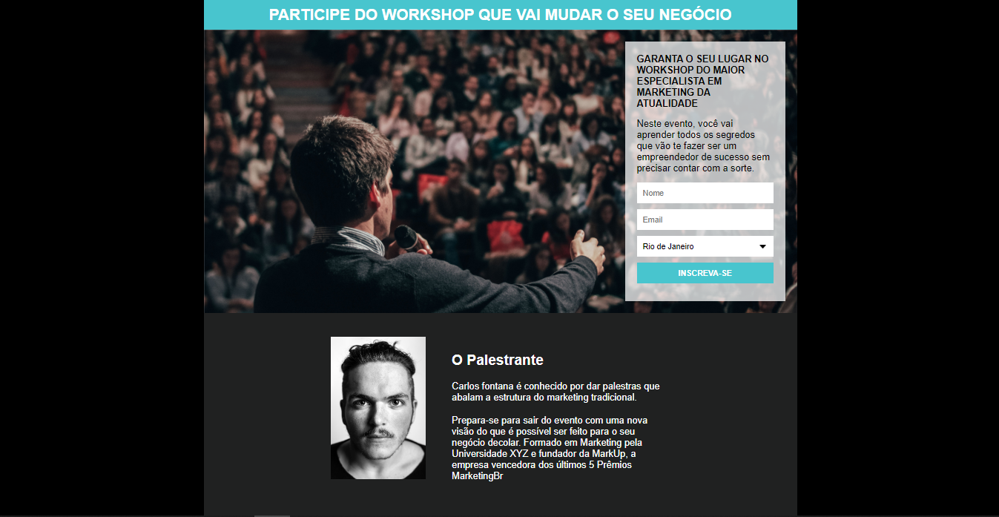

# Página de Captura

[Site](https://kaio-matos.github.io/pagina_de_captura/)
Página de captura feita para treinar os conhecimentos obtidos no curso do ProgramadorBr após o término de HTML e CSS básicos.

